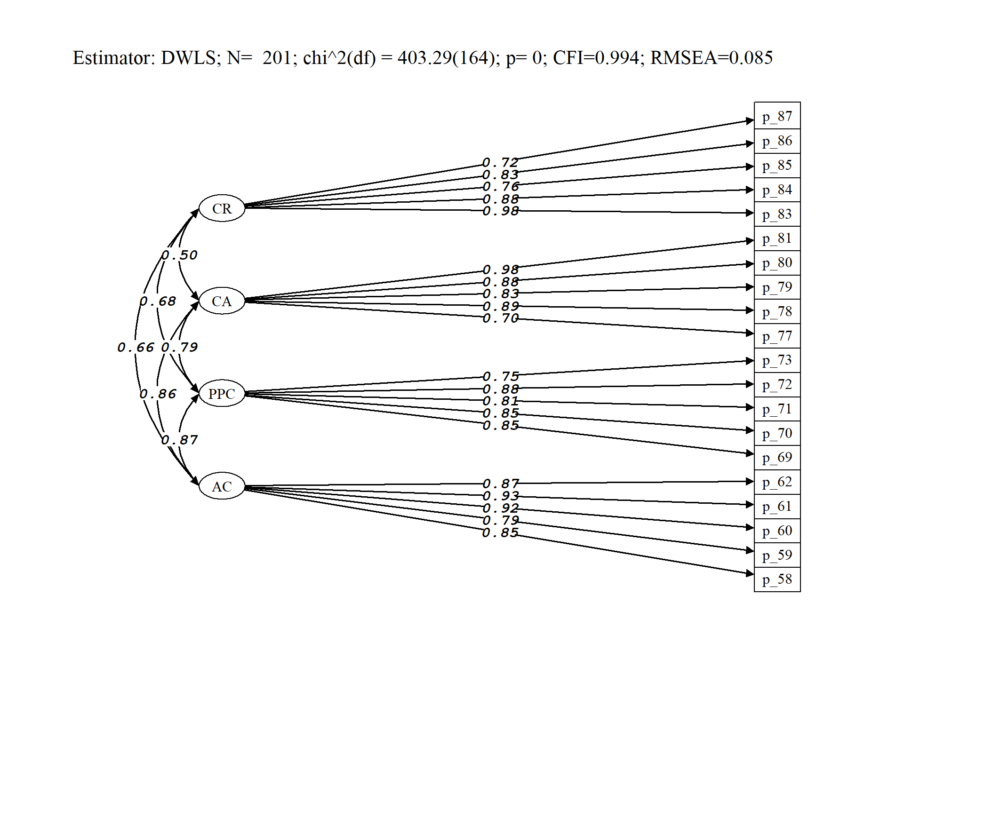
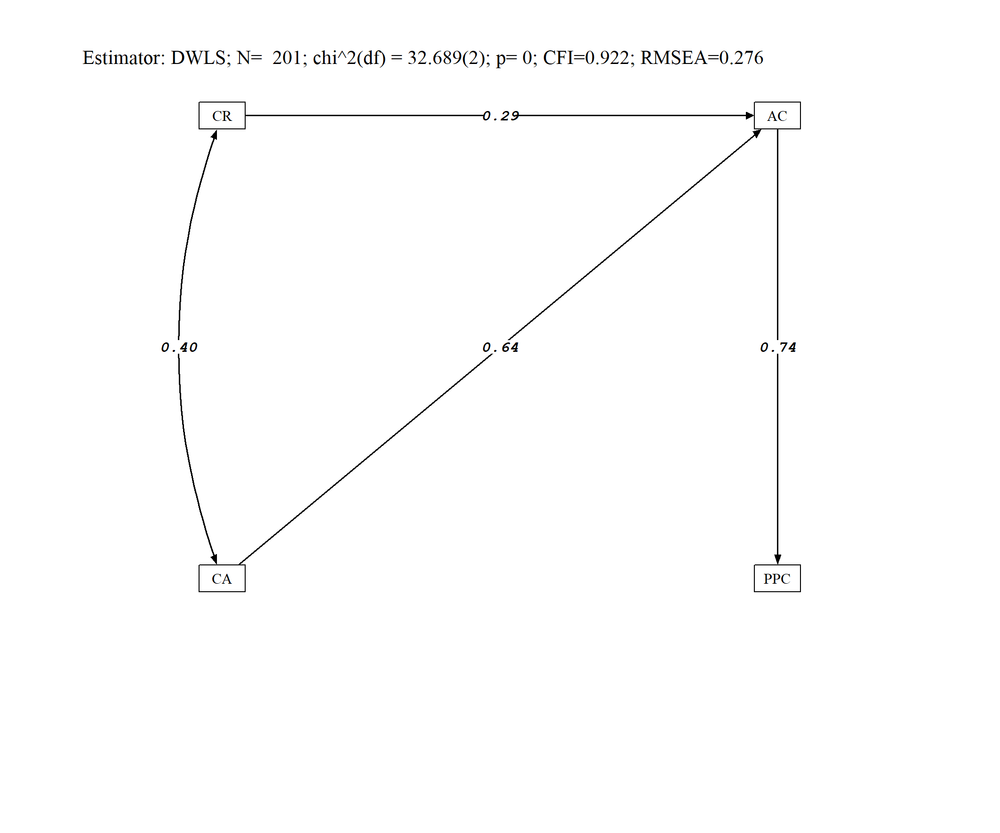
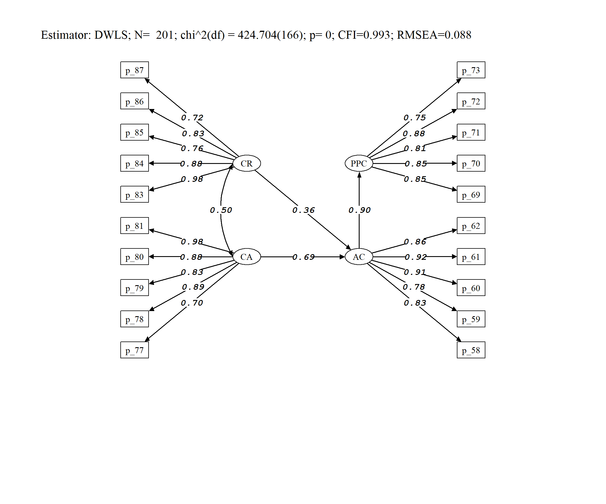

```{r setup, include=FALSE}
knitr::opts_chunk$set(eval=TRUE, warning = FALSE,message=FALSE)
```


```{r}
library(dplyr)

pacman::p_load(dplyr, kableExtra, knitr)

library(tidyverse)

```


```{r}
library(readxl)
bbdd_liderazgo <- read_excel("Base de datos_Proyecto RED CAP.xlsx")


#View(Base_de_datos_Proyecto_RED_CAP)
```

```{r}
#bbdd_liderazgo %>% summarytools::dfSummary(labels.col=T,display.labels=T) %>%  summarytools::view(file="coodebock.html")


```


```{r}
names(bbdd_liderazgo) = paste0("p_",1:143)


#paste0("p_",94:105)
```

```{r}
#summary(bbdd_liderazgo[,37:93])

#table(bbdd_liderazgo$p_95)

```


# Diseño de investigación

* ¿En que medida las Practicas del Personal Compartidas (PPC) median la relación entre las condiciones de apoyo (CA y CR) y la percepción de aprendizaje colaborativo (AC)

      +  ¿Es adecuada la dimensionalidad del modelo? 
      +  ¿Qué es más relevante para fomentar la percepción de aprendizaje colectivo (AC): Las codiciones de Apoyo estrucutrales (CA) o las Condiciones de Apoyo Relacionales (CR)
      + ¿En que medida la percepción de aprendizaje colectivo (AC) se explica por las practicas colectivas (PPC)


## Variables

|     AC                                                                                    |                                                                                                                                                             |     ESCALA     |           |           |           |
|-------------------------------------------------------------------------------------------|-------------------------------------------------------------------------------------------------------------------------------------------------------------|----------------|-----------|-----------|-----------|
|     1) APRENDIZAJE COLECTIVO ENTRE EL EQUIPO DOCENTE      |                                                                                                                                                             |     1          |     2     |     3     |     4     |
|     58.                                                                                   |     El equipo docente trabaja   conjuntamente para adquirir conocimientos, competencias y estrategias que   mejoren su desempeño profesional.               |                |           |           |           |
|     59.                                                                                   |     Existen buenas relaciones   profesionales entre el equipo docente que reflejan un compromiso con la   mejora de la escuela.                             |                |           |           |           |
|     60.                                                                                   |     El equipo docente trabaja y   planifica conjuntamente la búsqueda de soluciones alternativas para   responder mejor a las necesidades del alumnado.     |                |           |           |           |
|     61.                                                                                   |     El personal del centro educativo   encuentra oportunidades para aprender de los demás a través del diálogo   abierto.                                   |                |           |           |           |
|     62.                                                                                   |     El equipo docente mantiene entre   sí diálogos respetuosos en los que se toman en consideración los distintos   puntos de vista.                        |                |           |           |           |


|     PPC                                 |                                                                                                                                       |     ESCALA     |           |           |           |
|-----------------------------------------|---------------------------------------------------------------------------------------------------------------------------------------|----------------|-----------|-----------|-----------|
|     4) PRÁCTICA PERSONAL COMPARTIDA     |                                                                                                                                       |     1          |     2     |     3     |     4     |
|     69.                                 |     El equipo docente tiene   oportunidades para observar y alentar a sus compañeros analizando prácticas   de aula.                  |                |           |           |           |
|     70.                                 |     El equipo docente proporciona   retroalimentación a otros compañeros sobre sus prácticas docentes.                                |                |           |           |           |
|     71.                                 |     El equipo docente comparte   informalmente ideas y sugerencias para mejorar el aprendizaje de los   estudiantes.                  |                |           |           |           |
|     72.                                 |     El equipo docente revisa   colaborativamente el trabajo de los estudiantes para mejorar y compartir sus   prácticas docentes.     |                |           |           |           |
|     73.                                 |     En la institución educativa   existen oportunidades de ejercer orientación y tutoría con sus colegas.                             |                |           |           |           |


|     CR                                      |                                                                                                                                                            |     ESCALA     |           |           |           |
|---------------------------------------------|------------------------------------------------------------------------------------------------------------------------------------------------------------|----------------|-----------|-----------|-----------|
|     5) CONDICIONES DE APOYO: RELACIONES     |                                                                                                                                                            |     1          |     2     |     3     |     4     |
|     77.                                     |     Existen relaciones afectivas   entre equipo docente y estudiantes basadas en la confianza y el respeto.                                                |                |           |           |           |
|     78.                                     |     En la institución educativa   existe una cultura de confianza y respeto que permite asumir riesgos                                                     |                |           |           |           |
|     79.                                     |     Los éxitos logrados en el   centro se reconocen y celebran habitualmente.                                                                              |                |           |           |           |
|     80.                                     |     El equipo docente y la comunidad   educativa demuestran un esfuerzo constante y común para incorporar el cambio   en la cultura de la escuela.         |                |           |           |           |
|     81.                                     |     Las relaciones entre el equipo   docente permiten el análisis honesto y respetuoso de la información para   mejorar la enseñanza y el aprendizaje.     |                |           |           |           |


|     CA                                      |                                                                                                                                           |     ESCALA     |           |           |           |
|---------------------------------------------|-------------------------------------------------------------------------------------------------------------------------------------------|----------------|-----------|-----------|-----------|
|     6) CONDICIONES DE APOYO: ESTRUCTURA     |                                                                                                                                           |     1          |     2     |     3     |     4     |
|     83.                                     |     Se proporciona tiempo necesario   para realizar el trabajo en equipo.                                                                 |                |           |           |           |
|     84.                                     |     El horario escolar hace posible   y promueve el aprendizaje colectivo y la práctica compartida.                                       |                |           |           |           |
|     85.                                     |     Existen recursos económicos   disponibles para el desarrollo profesional.                                                             |                |           |           |           |
|     86.                                     |     El equipo docente dispone de la   tecnología y los materiales apropiados para la práctica docente.                                    |                |           |           |           |
|     87                                      |     El centro cuenta con expertos   externos que proporcionan asesoramiento y apoyo para el aprendizaje continuo   del equipo docente.    |                |           |           |           |

# Analisis factorial confirmatorio

```{r}
library(lavaan)


modelo_liderazgo <- '
          AC =~ p_58 + p_59 + p_60 + p_61 + p_62
          PPC =~ p_69 + p_70 + p_71 + p_72 + p_73
          CA =~  p_77 + p_78 + p_79 + p_80 + p_81
          CR = ~ p_83 + p_84 + p_85 + p_86 + p_87

'


mod_conf_cfa <- cfa(modelo_liderazgo, data = bbdd_liderazgo, ordered=T)

summary(mod_conf_cfa,
        standardized = TRUE, # mostrar cargas estandarizadas
        fit.measures = TRUE) # mostrar índices de ajuste extendidos


```


```{r, eval=FALSE}

library(sjPlot)
library(dplyr)
library(lavaan)
library(semPlot)
library(stargazer)
library(corrplot)
library(psych)
library(knitr)
library(kableExtra)
library(rvest)
library(sjlabelled)
library(ggplot2)

fm03<- data.frame(v1=fitmeasures(mod_conf_cfa, output ="matrix")[c("chisq","df","cfi","rmsea","pvalue"),])
fm03 <- round(fm03,3)
par(mai = c(2,2,2,2)) # Set the margin on all sides to 2
par(mar = c(5, 5, 5, 5)) # Set the margin on all sides to 6
layout(matrix(c(1, # semPlot
                1, # semPlot
                1,
                1,
                1,
                2),# ajuste
              nrow=6,
              byrow=TRUE))


# Crear el diagrama semPath
semPaths(
  mod_conf_cfa,           # Modelo de análisis factorial confirmatorio a visualizar
  whatLabels = "std",     # Etiquetas de valores estandarizados
  label.cex = 1,        # Tamaño de las etiquetas dentro de los nodos
  edge.label.cex = 1.2,   # Tamaño de los valores estimados en las flechas
  residuals = F,       # Mostrar residuos
  optimizeLatRes = FALSE, # Optimizar los residuos de factores latentes
  edge.color = "black",   # Color de las flechas
  style = "lisrel",       # Estilo del diagrama (por ejemplo, LISREL)
  nCharNodes = 0,         # Número de caracteres en los nodos (0 para auto)
  curvePivot = FALSE,     # Curvar las flechas de acuerdo a las cargas
  curve = 1.5,            # Curvatura de las flechas (ajustable)
  rotation = 2,           # Rotación del diagrama
  layout = "tree",       # Diseño del diagrama
  cardinal = "lat cov",   # Información sobre cardinalidad y covarianzas
  legend.cex = 0.6,       # Tamaño de la leyenda
  label.cex = 0.8,          # Tamaño de etiquetas
  label.font = 6,         # Fuente de etiquetas
  edge.label.font = 13,   # Fuente de etiquetas en las flechas
  asize = 3,              # Tamaño de las flechas
  edge.width = 1.2,       # Ancho de las flechas
  sizeMan = 2,            # Tamaño de las cajas de variables observadas (largo)
  sizeMan2 = 1,           # Tamaño de las cajas de variables observadas (alto)
  sizeLat = 2,          # Tamaño de los elipses de factores latentes (largo)
  sizeLat2 = 1,          # Tamaño de los elipses de factores latentes (alto)
  residScale = 1,        # Escala de los residuos
  width = 3,           # Ancho del diagrama
  height = 3,            # Alto del diagrama
  intercepts = FALSE,     # Mostrar interceptos
  reorder = F,         # Reorganizar los nodos
  thresholds = FALSE,     # Mostrar umbrales
  fixedStyle = 1,         # Estilo fijo
  node.height = 4,        # Altura de los nodos (ajustable para aumentar la separación vertical)
  node.width = 4,         # Ancho de los nodos
  label.scale = T,    # Escala de etiquetas
  shapeMan = "rectangle", # Forma de las cajas de variables observadas
  shapeLat = "ellipse",   # Forma de los elipses de factores latentes
  details = TRUE          # Mostrar detalles en el diagrama
)


ld<- standardizedsolution(mod_conf_cfa) %>% select(lhs,op,rhs,est.std) %>% filter(op=="=~") 
ld$est.std<- sprintf("%.2f", ld$est.std)


#install.packages("draw")
library(draw) #para hacer rectangulo de fit


size <- 10


drawText(x = 3, y = 5.5, text = paste0("Estimator: DWLS", "; N=  ",nobs(mod_conf_cfa), "; chi^2(df) = ",fm03[1,],"(",fm03[2,],")","; p= ",fm03[5,],"; CFI=",fm03[3,],"; RMSEA=",fm03[4,]),family = "serif",size = 10)


drawExport("ajuste.png",units = "cm",width = 18,height = 15,ppi = 300) 

```




```{r}
modificationindices(mod_conf_cfa) %>% arrange(-mi)  %>% head(10)
```


# Analisis de sendeross

```{r,message=TRUE}

bbdd_liderazgo_mean=bbdd_liderazgo %>% mutate(

          AC = (p_58 + p_59 + p_60 + p_61 + p_62)/5,
          
          PPC = (p_69 + p_70 + p_71 + p_72 + p_73)/5,
          CA =  (p_77 + p_78 + p_79 + p_80 + p_81)/5,
          CR =  (p_83 + p_84 + p_85 + p_86 + p_87)/5

  
) %>% select(AC:CR ) #%>% tidyr::pivot_longer(cols=1:6)


#t.test(bbdd_liderazgo_mean$LC, bbdd_liderazgo_mean$VC)

```

```{r}


modelo_liderazgo <- '
             
          PPC ~  AC  
          
          AC~ CA + CR

'


mod_conf_cfa <- lavaan::sem(modelo_liderazgo, data = bbdd_liderazgo_mean %>% na.omit())


```


```{r}
summary(mod_conf_cfa,standardized = TRUE, fit.measures = TRUE, rsquare=T) 
```


```{r, eval=FALSE}

library(sjPlot)
library(dplyr)
library(lavaan)
library(semPlot)
library(stargazer)
library(corrplot)
library(psych)
library(knitr)
library(kableExtra)
library(rvest)
library(sjlabelled)
library(ggplot2)

fm03<- data.frame(v1=fitmeasures(mod_conf_cfa, output ="matrix")[c("chisq","df","cfi","rmsea","pvalue"),])
fm03 <- round(fm03,3)
par(mai = c(2,2,2,2)) # Set the margin on all sides to 2
par(mar = c(5, 5, 5, 5)) # Set the margin on all sides to 6
layout(matrix(c(1, # semPlot
                1, # semPlot
                1,
                1,
                1,
                2),# ajuste
              nrow=6,
              byrow=TRUE))


# Crear el diagrama semPath
semPaths(
  mod_conf_cfa,           # Modelo de análisis factorial confirmatorio a visualizar
  whatLabels = "std",     # Etiquetas de valores estandarizados
  label.cex = 1,        # Tamaño de las etiquetas dentro de los nodos
  edge.label.cex = 1.2,   # Tamaño de los valores estimados en las flechas
  residuals = F,       # Mostrar residuos
  optimizeLatRes = FALSE, # Optimizar los residuos de factores latentes
  edge.color = "black",   # Color de las flechas
  style = "lisrel",       # Estilo del diagrama (por ejemplo, LISREL)
  nCharNodes = 0,         # Número de caracteres en los nodos (0 para auto)
  curvePivot = FALSE,     # Curvar las flechas de acuerdo a las cargas
  curve = 1.5,            # Curvatura de las flechas (ajustable)
  rotation = 2,           # Rotación del diagrama
  layout = "tree",       # Diseño del diagrama
  cardinal = "lat cov",   # Información sobre cardinalidad y covarianzas
  legend.cex = 0.6,       # Tamaño de la leyenda
  label.cex = 0.8,          # Tamaño de etiquetas
  label.font = 6,         # Fuente de etiquetas
  edge.label.font = 13,   # Fuente de etiquetas en las flechas
  asize = 3,              # Tamaño de las flechas
  edge.width = 1.2,       # Ancho de las flechas
  sizeMan = 2,            # Tamaño de las cajas de variables observadas (largo)
  sizeMan2 = 1,           # Tamaño de las cajas de variables observadas (alto)
  sizeLat = 2,          # Tamaño de los elipses de factores latentes (largo)
  sizeLat2 = 1,          # Tamaño de los elipses de factores latentes (alto)
  residScale = 1,        # Escala de los residuos
  width = 3,           # Ancho del diagrama
  height = 3,            # Alto del diagrama
  intercepts = FALSE,     # Mostrar interceptos
  reorder = F,         # Reorganizar los nodos
  thresholds = FALSE,     # Mostrar umbrales
  fixedStyle = 1,         # Estilo fijo
  node.height = 4,        # Altura de los nodos (ajustable para aumentar la separación vertical)
  node.width = 4,         # Ancho de los nodos
  label.scale = T,    # Escala de etiquetas
  shapeMan = "rectangle", # Forma de las cajas de variables observadas
  shapeLat = "ellipse",   # Forma de los elipses de factores latentes
  details = TRUE          # Mostrar detalles en el diagrama
)


ld<- standardizedsolution(mod_conf_cfa) %>% select(lhs,op,rhs,est.std) %>% filter(op=="=~") 
ld$est.std<- sprintf("%.2f", ld$est.std)


#install.packages("draw")
library(draw) #para hacer rectangulo de fit


size <- 10


drawText(x = 3, y = 5.5, text = paste0("Estimator: DWLS", "; N=  ",nobs(mod_conf_cfa), "; chi^2(df) = ",fm03[1,],"(",fm03[2,],")","; p= ",fm03[5,],"; CFI=",fm03[3,],"; RMSEA=",fm03[4,]),family = "serif",size = 10)


drawExport("ajuste2.png",units = "cm",width = 18,height = 15,ppi = 300) 

```




```{r}
modificationindices(mod_conf_cfa) %>% arrange(-mi)  %>% head(10)
```


# Analisis SEM

```{r}
#t.test(bbdd_liderazgo_mean$LC, bbdd_liderazgo_mean$VC)

bbdd_liderazgo_rec= bbdd_liderazgo %>% select(p_58:p_87 )

```

```{r}


modelo_liderazgo <- '
     
          AC =~ p_58 + p_59 + p_60 + p_61 + p_62
          PPC =~ p_69 + p_70 + p_71 + p_72 + p_73
          CA =~  p_77 + p_78 + p_79 + p_80 + p_81
          CR = ~ p_83 + p_84 + p_85 + p_86 + p_87

             
          PPC ~  AC  
          AC~ CA + CR

'


mod_conf_cfa <- lavaan::sem(modelo_liderazgo, data = bbdd_liderazgo_rec %>% na.omit() , ordered=T)

summary(mod_conf_cfa,standardized = TRUE, fit.measures = TRUE, rsquare=T) %>% print()
```


```{r, eval=FALSE}

library(sjPlot)
library(dplyr)
library(lavaan)
library(semPlot)
library(stargazer)
library(corrplot)
library(psych)
library(knitr)
library(kableExtra)
library(rvest)
library(sjlabelled)
library(ggplot2)

fm03<- data.frame(v1=fitmeasures(mod_conf_cfa, output ="matrix")[c("chisq","df","cfi","rmsea","pvalue"),])
fm03 <- round(fm03,3)
par(mai = c(2,2,2,2)) # Set the margin on all sides to 2
par(mar = c(5, 5, 5, 5)) # Set the margin on all sides to 6
layout(matrix(c(1, # semPlot
                1, # semPlot
                1,
                1,
                1,
                2),# ajuste
              nrow=6,
              byrow=TRUE))


# Crear el diagrama semPath
semPaths(
  mod_conf_cfa,           # Modelo de análisis factorial confirmatorio a visualizar
  whatLabels = "std",     # Etiquetas de valores estandarizados
  label.cex = 1,        # Tamaño de las etiquetas dentro de los nodos
  edge.label.cex = 1.2,   # Tamaño de los valores estimados en las flechas
  residuals = F,       # Mostrar residuos
  optimizeLatRes = FALSE, # Optimizar los residuos de factores latentes
  edge.color = "black",   # Color de las flechas
  style = "lisrel",       # Estilo del diagrama (por ejemplo, LISREL)
  nCharNodes = 0,         # Número de caracteres en los nodos (0 para auto)
  curvePivot = FALSE,     # Curvar las flechas de acuerdo a las cargas
  curve = 1.5,            # Curvatura de las flechas (ajustable)
  rotation = 2,           # Rotación del diagrama
  layout = "tree",       # Diseño del diagrama
  cardinal = "lat cov",   # Información sobre cardinalidad y covarianzas
  legend.cex = 0.6,       # Tamaño de la leyenda
  label.cex = 0.8,          # Tamaño de etiquetas
  label.font = 6,         # Fuente de etiquetas
  edge.label.font = 13,   # Fuente de etiquetas en las flechas
  asize = 3,              # Tamaño de las flechas
  edge.width = 1.2,       # Ancho de las flechas
  sizeMan = 2,            # Tamaño de las cajas de variables observadas (largo)
  sizeMan2 = 1,           # Tamaño de las cajas de variables observadas (alto)
  sizeLat = 2,          # Tamaño de los elipses de factores latentes (largo)
  sizeLat2 = 1,          # Tamaño de los elipses de factores latentes (alto)
  residScale = 1,        # Escala de los residuos
  width = 3,           # Ancho del diagrama
  height = 3,            # Alto del diagrama
  intercepts = FALSE,     # Mostrar interceptos
  reorder = F,         # Reorganizar los nodos
  thresholds = FALSE,     # Mostrar umbrales
  fixedStyle = 1,         # Estilo fijo
  node.height = 4,        # Altura de los nodos (ajustable para aumentar la separación vertical)
  node.width = 4,         # Ancho de los nodos
  label.scale = T,    # Escala de etiquetas
  shapeMan = "rectangle", # Forma de las cajas de variables observadas
  shapeLat = "ellipse",   # Forma de los elipses de factores latentes
  details = TRUE          # Mostrar detalles en el diagrama
)


ld<- standardizedsolution(mod_conf_cfa) %>% select(lhs,op,rhs,est.std) %>% filter(op=="=~") 
ld$est.std<- sprintf("%.2f", ld$est.std)


#install.packages("draw")
library(draw) #para hacer rectangulo de fit


size <- 10


drawText(x = 3, y = 5.5, text = paste0("Estimator: DWLS", "; N=  ",nobs(mod_conf_cfa), "; chi^2(df) = ",fm03[1,],"(",fm03[2,],")","; p= ",fm03[5,],"; CFI=",fm03[3,],"; RMSEA=",fm03[4,]),family = "serif",size = 10)


drawExport("ajuste3.png",units = "cm",width = 18,height = 15,ppi = 300) 

```





```{r}
modificationindices(mod_conf_cfa) %>% arrange(-mi)  %>% head(10)
```

